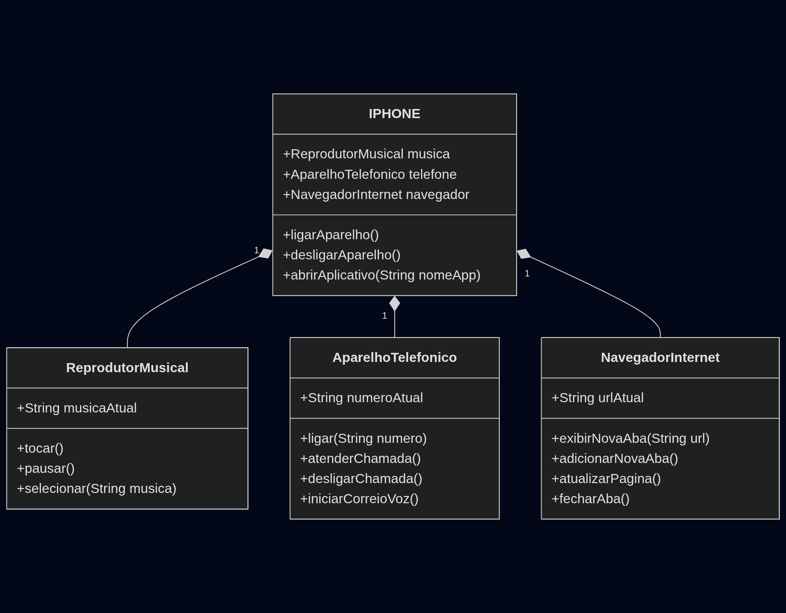

# 📱 Desafio DIO: Modelagem e Diagramação de um Componente iPhone

> Recriando a essência do primeiro iPhone através dos pilares da Programação Orientada a Objetos.

---

## 📝 Descrição do Projeto

Este projeto é a resolução de um desafio proposto pela **Digital Innovation One (DIO)**, focado na modelagem e implementação dos componentes de um **iPhone de 2007**, conforme apresentado em seu lançamento histórico. O objetivo foi aplicar os princípios da **Programação Orientada a Objetos (POO)**, como abstração, encapsulamento, herança e polimorfismo, para representar as funcionalidades de um iPhone como:

* **Reprodutor Musical**
* **Aparelho Telefônico**
* **Navegador na Internet**

O desafio incluiu tanto a **diagramação UML** (foco em classes e interfaces) quanto a **implementação prática** em Java.

---

## 🛠️ Tecnologias Utilizadas

* **Linguagem:** `Java 21` (ou versão compatível)
* **Ferramenta UML:** `https://mermaid.live/` (ou sua ferramenta preferida, ex: Draw.io, PlantUML)
* **IDE:** `VS Code` (ou sua IDE preferida, ex: VS Code, Eclipse)
* **Controle de Versão:** `Git` e `GitHub`

---

## 📋 Diagramação UML

A diagramação foi a primeira etapa, focando em como as interfaces e classes se relacionariam para construir o componente `iPhone`.

* **Diagrama de Classes e Interfaces:**

   

    Neste diagrama, podemos observar:
    * **Interfaces:** `ReprodutorMusical`, `AparelhoTelefonico` e `NavegadorInternet` definem os contratos das funcionalidades.
    * **Classes de Implementação:** Classes concretas que implementam os comportamentos definidos nas interfaces.
    * **Classe `Dispositivo`:** Uma classe que integra e utiliza essas interfaces para compor o objeto "iPhone", demonstrando o conceito de **composição** e **polimorfismo** (o iPhone "é um" Aparelho Telefônico, "é um" Reprodutor Musical, etc., através da implementação de suas interfaces, e "tem um" Aparelho Telefônico, etc., através da composição de instâncias).

---

## ✨ Funcionalidades Implementadas

As funcionalidades foram implementadas com base nos métodos esperados para cada interface:

### 🎵 Reprodutor Musical
* `tocar()`
* `pausar()`
* `selecionarMusica(String musica)`

### 📞 Aparelho Telefônico
* `ligar(String numero)`
* `atenderChamada()`
* `iniciarCorreioVoz()`
* `desligarChamada()`

### 🌐 Navegador na Internet
* `exibirPagina(String url)`
* `adicionarNovaAba()`
* `atualizarPagina()`
* `fecharAba()`

---

## 🧠 Desafios e Aprendizados

Este desafio foi uma excelente oportunidade para solidificar conceitos fundamentais de POO:

* **Abstração e Interfaces:** Compreender como interfaces definem contratos e abstraem comportamentos, permitindo flexibilidade e extensibilidade. O iPhone, sendo um "conjunto de funcionalidades", se encaixou perfeitamente neste modelo.
* **Composição vs. Herança:** A decisão de usar **composição** (o `iPhone` "tem um" ReprodutorMusical, um AparelhoTelefonico e um NavegadorInternet) em vez de herança múltipla (não suportada diretamente em Java para classes) para agrupar as funcionalidades. Isso resultou em um design mais flexível e menos acoplado.
* **Polimorfismo:** Observar como o `iPhone` interage com suas funcionalidades através das interfaces, permitindo que diferentes implementações futuras possam ser plugadas sem alterar o código principal do iPhone.
* **Diagramação UML:** A prática da diagramação foi crucial para visualizar a arquitetura antes de codificar, identificando as responsabilidades de cada componente e as relações entre eles.

---

## 🧑‍💻 Autor

* **Sergio Hermany Peter Cainzo**
* [GitHub](https://github.com/sergiocainzo)

---

## Link para o desafio
* [Desafio DIO: Modelagem e Diagramação de um Componente](https://github.com/digitalinnovationone/trilha-java-basico/tree/main/desafios/poo)

